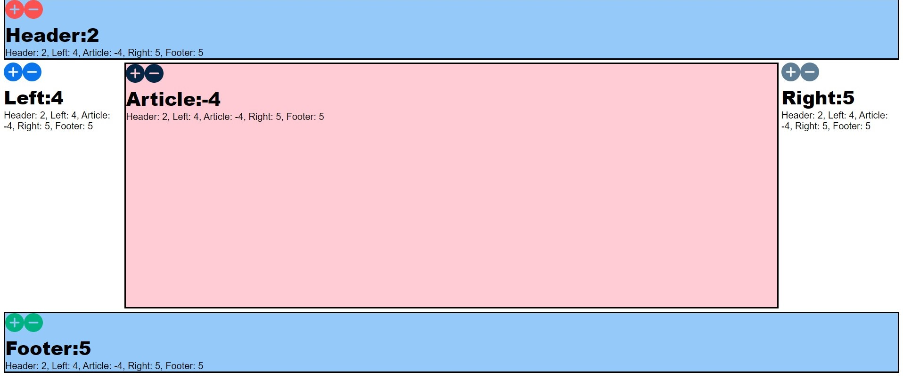

# Full-Stack-Holy-Grail-App
## Full Stack Holy Grail App Project

Through the use of React and Superagent on the client side, Expres and Node at the HTTP server, and Redis and Docker for data store, this exercise demonstrates a full-stack application, with synchronized communication between the client, server, and data store.  
To run this on your machine, download the files and follow these steps: 
1. Make sure Docker is running. 
2. Open a terminal window and navigate to the file folder. 
3. Type docker run -p 6379:6379 --name some-redis -d redis:4.0.1 
4. Type npm install redis@4.0.1
3. Type node index.js 
4. Go to http://localhost:3000 and test out the plus and minus buttons or go to one of the branches and change the number that way, such as http://localhost:3000/right/5 then http://localhost:3000/data to see your result.
  
This is basic and foundational, but additional functionality could be endless. The user interface can be changed in many ways to suit many needs.  
MIT License  
Copyright (c) 2023 Yvette Watson  
Permission is hereby granted, free of charge, to any person obtaining a copy of this software and associated documentation files (the "Software"), to deal in the Software without restriction, including without limitation the rights to use, copy, modify, merge, publish, distribute, sublicense, and/or sell copies of the Software, and to permit persons to whom the Software is furnished to do so, subject to the following conditions:
The above copyright notice and this permission notice shall be included in all copies or substantial portions of the Software.  
THE SOFTWARE IS PROVIDED "AS IS", WITHOUT WARRANTY OF ANY KIND, EXPRESS OR IMPLIED, INCLUDING BUT NOT LIMITED TO THE WARRANTIES OF MERCHANTABILITY, FITNESS FOR A PARTICULAR PURPOSE AND NONINFRINGEMENT. IN NO EVENT SHALL THE AUTHORS OR COPYRIGHT HOLDERS BE LIABLE FOR ANY CLAIM, DAMAGES OR OTHER LIABILITY, WHETHER IN AN ACTION OF CONTRACT, TORT OR OTHERWISE, ARISING FROM, OUT OF OR IN CONNECTION WITH THE SOFTWARE OR THE USE OR OTHER DEALINGS IN THE SOFTWARE.
